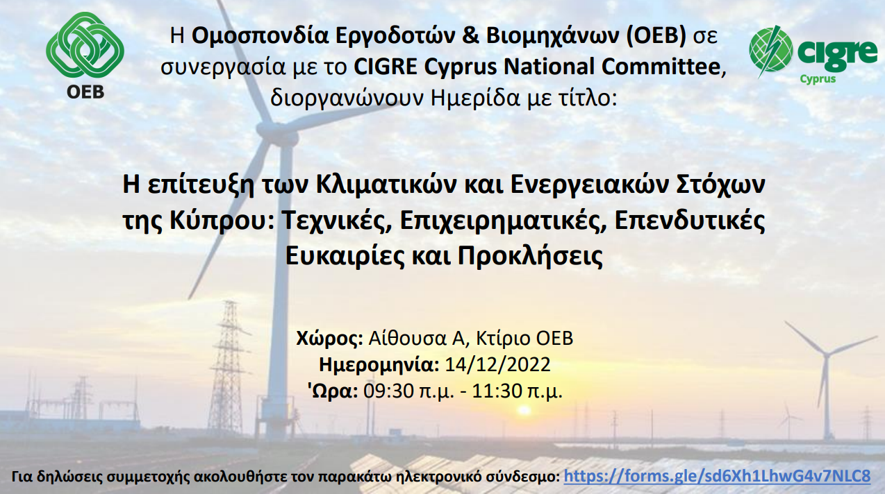
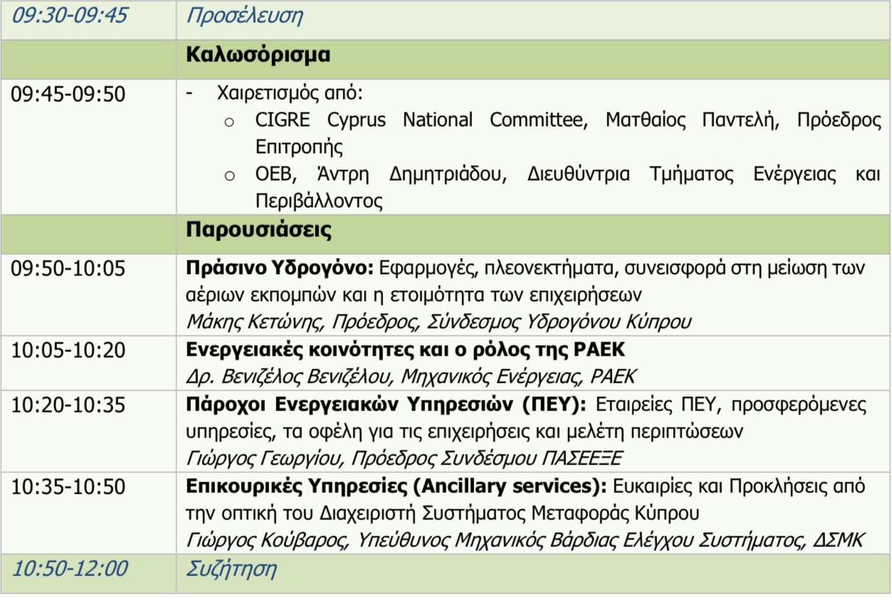

Η CIGRE Cyprus National Committee και Βιομηχάνων (ΟΕΒ), σε συνεργασία με την Ομοσπονδία Εργοδοτών, διοργανώνουν Ημερίδα με τίτλο: Η επίτευξη των Κλιματικών και Ενεργειακών Στόχων της Κύπρου: Τεχνικές, Επιχειρηματικές, Επενδυτικές Ευκαιρίες και Προκλήσεις. Η ημερίδα θα διεξαχθεί δια ζώσης, στις 14 Δεκεμβρίου 2022 η ώρα 09:30 π.μ. – 11:30 π.μ., στα γραφεία της ΟΕΒ (Αίθουσα Α).

 

Στην Ημερίδα θα παρουσιαστούν:

 

Για δηλώσεις συμμετοχής ακολουθήστε το παρακάτω ηλεκτρονικό σύνδεσμο https://forms.gle/TdayAwrdUkcQW6zGA.
